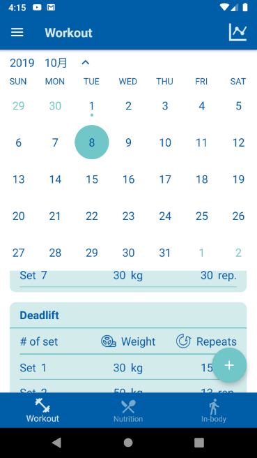
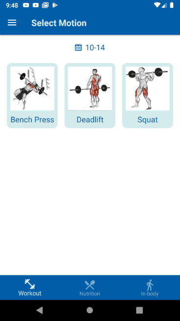
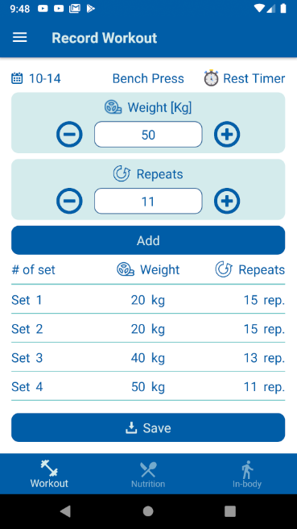
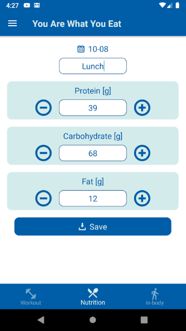
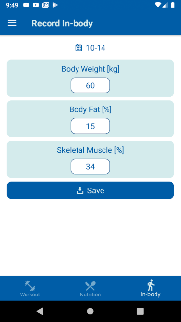
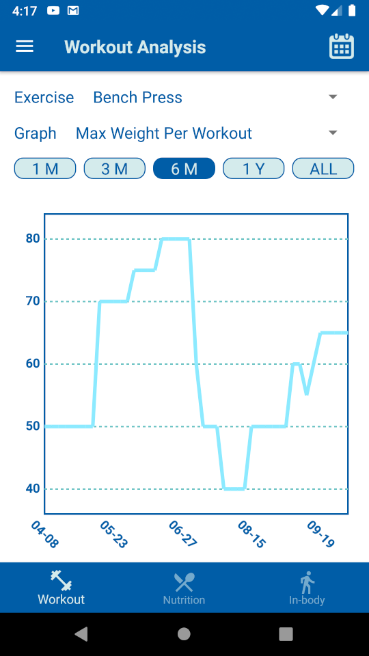
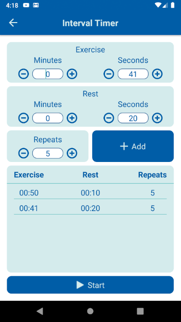
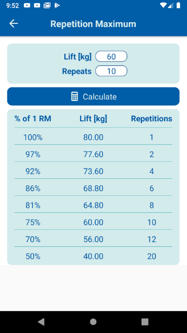
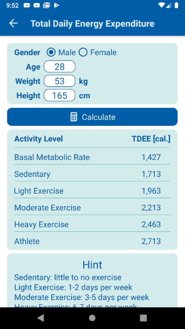

# Fitracker
Records and analyses fitness, nutrition, and in-body data.

# Features
1. Overview: Selects the date on calendar to review records on specific date. There are three classes, workout, nutrition, and in-body, on overview.

2. Record: Clicks the '+' button on the bottom right corner of overview fragment to record daily workout, nutrient absortion, and in-body.

* On __Workout__, selects motion then records all stes of the workout. The timer icon on top right is a rest timer.

  
  

  

* On __Nutrition__, records protein, fat, and carbohydrate aborted on the meal.
 

   
 
  

* On __In-body__, records weight, body fat, and skeletal muscle.
 

   
 

3. Analysis: Shows workout, nutrition, or in-body data over the past 1 month, 3 monthes, 6 monthes, 1 year, or all the time by linechart.

4. Tools
* Interval Timer: This timer could sets various pattern to fit different interval training. A pattern contains exercise time, rest time, and repetition.

* Repetition Maximum (RM) Calculator

* Total Daily Energy Expenditure (TDEE) Calculator

* Recommended Video

# Implemented
* Language - Kotlin
* Architecture - MVVM
* Patterns - Observer, Factory and Singleton
* Jetpack - ViewModel, LiveData, Lifecycle, Data Binding, Fragment, App Navigation, ConstraintLayout and RecyclerView
* Data Storage - SharedPreference, Firebase cloud Firestore
* Login - Google login API, Firebase Authenticaiton
* 3rd party plugins - [CalendarView](https://github.com/kizitonwose/CalendarView), [AndroidYouTubePlayer](https://github.com/PierfrancescoSoffritti/android-youtube-player) and [MPAndroidChart](https://github.com/PhilJay/MPAndroidChart)

# Requirement
* Android Studio 3.0+
* Android SDK 26+
* Gradle 5.1.1+

# Contact
Pin Hsiang, Wang [fitracker27365@gmail.com](fitracker27365@gmail.com)
